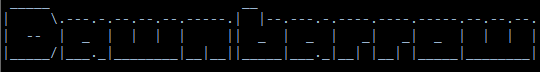

# 


A WinForms text-adventure RPG built with C# and .NET 8.

Dawnbarrow mixes command-driven exploration/combat with a visual UI layer (minimap, inventory/shop panels, status readouts, and biome backgrounds). The project is now primarily data-driven for world layout and encounter content.

## Tech Stack

- C#
- .NET 8 (`net8.0-windows`)
- Windows Forms ('WinForms')
- JSON content configuration

## Features

- Command-line style gameplay inside a desktop app UI.
- Dynamic world map generated from JSON room definitions.
- Data-driven room encounters and biome explore encounters.
- Equipment/inventory progression with consumables and scrolls.
- Combat system with skills, spells, status effects, and unique enemy skills.
- Shop UI and buy flow.
- Save/load system with named save files.
- Command usage lookup (`? <command>` / `usage <command>`).

## Run The Game

### Requirements

- Windows
- .NET 8 SDK

### Build

```powershell
dotnet build
```

### Run

```powershell
dotnet run
```

## Core Commands

Movement
- `north`, `south`, `east`, `west` (or `n/s/e/w`)

Combat
- `fight`
- `hit`
- Spells: `fireball`, `ice ball`, `heal`
- Skills: `bash`, `slice`, `ultra instinct`, `rupture`, `battle trance`
- `run`

Exploration / Progression
- `look around`
- `explore`
- `search ground`
- `inventory`
- `equip <item>`
- `take off <item>`
- `map`

Shop / Consumables
- `shop`
- `buy <item>`
- `use fire bomb`
- `use scroll of freezing`
- `use scroll of fire`
- `use scroll of flight x y`

Save / Load / Utility
- `save` or `save <filename>`
- `load` or `load <filename>`
- `restart`
- `suicide`
- `? <command>` or `usage <command>`

Testing
- `spawn` or `spawn here` to force-spawn current room encounter (if defined)
- `cheat`

## Data-Driven Content

### World Definition

`Data/world-data.json`

Defines the map rooms and their properties:
- Coordinates (`X`, `Y`)
- Biome name
- Direction connectivity flags
- Repeatable encounter flag
- Room description/subtext

The map and minimap scale automatically based on the min/max room coordinates found in this file.

### Gameplay Definition

`Data/game-data.json`

Defines runtime gameplay content:
- `ExploreLoot`
- `ShopItems`
- `RoomEncounters`
- `ExploreEncounterProfiles`
- `EnemySkills`
- `CommandUsage`

## Adding New Content

### Add New Rooms

1. Add room entries in `Data/world-data.json`.
2. Set directional flags on connected rooms consistently (both sides of the connection).
3. Add optional encounter entries for those coordinates in `Data/game-data.json` under `RoomEncounters`.

### Add New Encounter Profiles

Use `ExploreEncounterProfiles` in `Data/game-data.json` to tune roaming encounter threat by biome keyword, stat ranges, and weighted enemy names.

### Add New Shop Items

1. Add an entry to `ShopItems`.
2. Ensure there is command handling in code if the item requires custom behavior.

## Save Files

- Default save filename: `Dawnbarrow_save.json`
- Named saves are written as `<name>.json`
- Saves are written near the runtime output location (one level above executable base directory)

## Notes

- World coordinates below 1 are currently ignored by loader validation.
- Some special scripted interactions still use coordinate-based logic in code (for example, a few quest-like interactions).

## Project Structure (High-Level)

- `Form1.cs`: Main gameplay loop and command parser
- `Form1.Data.cs`: JSON loading and encounter data plumbing
- `Form1.StatusEffects.cs`: Status effect engine + enemy skill resolution
- `Form1.Inventory.cs`: Inventory panel behavior
- `Form1.Shop.cs`: Shop panel behavior
- `Form1.Usage.cs`: Usage/help command dictionary and resolver
- `WorldData.cs`: World-room loader and bounds cache
- `Room.cs`: Movement/connectivity wrapper over world data
- `Game.cs`: Room text and map rendering logic


Welcome Bryant 04/19/2026